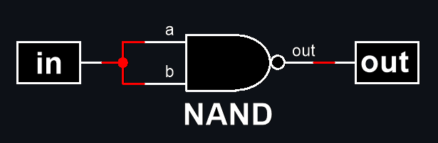
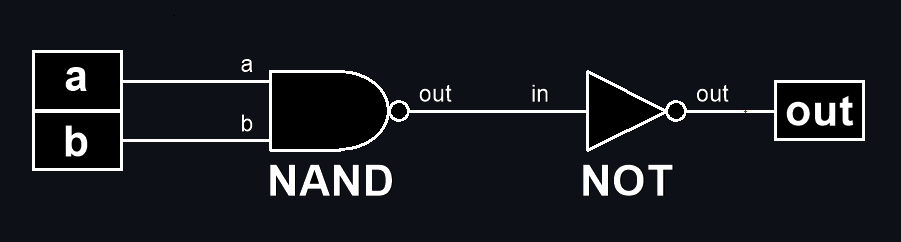
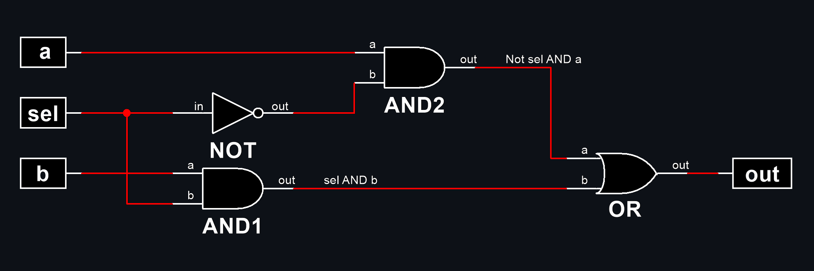
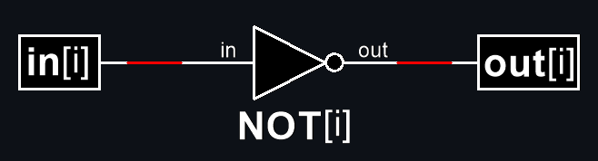
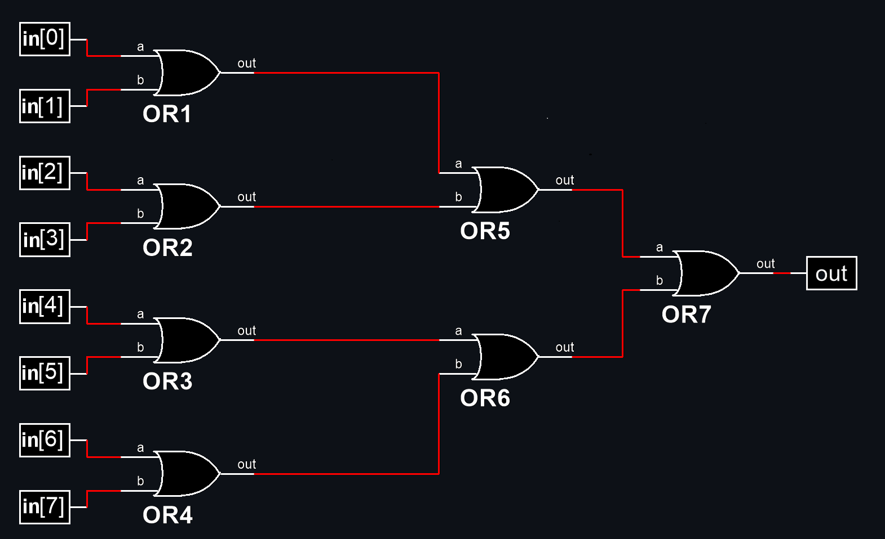

# from-nand-to-tetris

in this repository I implement all the tasks from the course Build a Modern Computer from First Principles: From Nand to Tetris (Project-Centered Course).

# projects tasks
<details>

<summary>project1 : Boolean Logic</summary>

## Nand (given)
Chip name: `Nand`

Input: `a, b`

Output: `out`

Function: `if ((a==1) and (b==1)) then out = 0, else out = 1`

|a|b|out|
|-|-|-|
|0|0|1|
|0|1|1|
|1|0|1|
|1|1|0|
 
## Not
Chip name: `Not`

Input: `in`

Output: `out`

Function: `if (in==0) then out = 1, else out = 0`

|in|out|
|-|-|
|0|1|
|1|0|

My implementation:



## And
Chip name: `And`

Input: `a, b`

Output: `out`

Function: `if ((a==1) and (b==1)) then out = 1, else out = 0`

|a|b|out|
|-|-|-|
|0|0|0|
|0|1|0|
|1|0|0|
|1|1|1|

My implementation:



## Or
Chip name: `Or`

 Input: `a, b`
 
 Output: `out`
 
 Function: `if ((a==0) and (b==0)) then out = 0, else out = 1`

|a|b|out|
|-|-|-|
|0|0|0|
|0|1|1|
|1|0|1|
|1|1|1|

My implementation:


## Xor
 Chip name: `Xor`
 
 Input: `a, b`
 
 Output: `out`
 
 Function: `if (a!=b) then out = 1, else out = 0`

|a|b|out|
|-|-|-|
|0|0|0|
|0|1|1|
|1|0|1|
|1|1|0|

My implementation:


## Mux
Chip name: `Mux`

 Input:     `a, b, sel`
 
 Output:    `out`
 
 Function:  `if (sel == 0) then out = a, else out = b`

| a | b |sel|out|
|-|-|-|-|
| 0 | 0 | 0 | 0 |
| 0 | 0 | 1 | 0 |
| 0 | 1 | 0 | 0 |
| 0 | 1 | 1 | 1 |
| 1 | 0 | 0 | 1 |
| 1 | 0 | 1 | 0 |
| 1 | 1 | 0 | 1 |
| 1 | 1 | 1 | 1 |

sel|out|
|-|-|
|0|a|
|1|b|

My implementation:



## DMux
 Chip name: `DMux`
 
 Input:     `in, sel`
 
 Output:    `a, b`

 Function: `if (sel==0) then {a,b}={in,0}, else {a,b}={0,in}`

|  in   |  sel  |   a   |   b   |
|-|-|-|-|
|   0   |   0   |   0   |   0   |
|   0   |   1   |   0   |   0   |
|   1   |   0   |   1   |   0   |
|   1   |   1   |   0   |   1   |
 
My implementation:


## Not16
 Chip name: `Not16`
 
 Input: `in[16]`
 
 Output: `out[16]`
 
 Function: `for i = 0..15 out[i] = Not(in[i])`

My implementation:



## And16
Chip name: `And16`

 Input: `a[16], b[16]`
 
 Output: `out[16]`
 
 Function: `for i = 0..15 out[i] = And(a[i], b[i])`

My implementation:


## Or16
Chip name: `Or16`

 Input: `a[16], b[16]`
 
 Output: `out[16]`
 
 Function: `for i = 0..15 out[i] = Or(a[i], b[i])`

My implementation:


## Mux16
Chip name: `Mux16`

 Input: `a[16], b[16], sel`
 
 Output: `out[16]`
 
 Function: `if (sel==0) then for i = 0..15 out[i] = a[i],
 else for i = 0..15 out[i] = b[i]`
 
My implementation:


## Or8Way
Chip name: `Or8Way`

 Input: `in[8]`
 
 Output: `out`
 
 Function: `out = Or(in[0], in[1],…, in[7])`

My implementation:



## Mux4Way16
 Chip name: `Mux4Way16`
 
 Input: `a[16], b[16], c[16], d[16], sel[2]`
 
 Output: `out[16]`
 
 Function: `if (sel==00,01,10, or 11) then out = a, b, c, or d`
 
 Comment: `The assignment is a 16-bit operation.
 For example, "out = a" means "for i = 0..15 
out[i] = a[i]"`

|sel[1]|sel[0]|out|
|-|-|-|
|0|0|a|
|0|1|b|
|1|0|c|
|1|1|d|

My implementation:


## Mux8Way16
 Chip name: `Mux8Way16`

 Input: `a[16], b[16], c[16], d[16], e[16], f[16], 
g[16], h[16], sel[3]`

 Output: `out[16]`

 Function: `if (sel==000,001,010, …, or 111)then out = a, 
b, c, d, …, or h`

 Comment: `The assignment is a 16-bit operation.
 For example, "out = a" means "for i = 0..15 
out[i] = a[i]".`

|sel[2]|sel[1]|sel[0]|out|
|-|-|-|-|
|0|0|0|a|
|0|0|1|b|
|0|1|0|c|
|0|1|1|d|
|1|0|0|e|
|1|0|1|f|
|1|1|0|g|
|1|1|1|h|

My implementation:


## DMux4Way
Chip name: `DMux4Way`

 Input: `in, sel[2]`

 Output: `a, b, c, d`

 Function: 
 ```
if (sel==00) then {a, b, c, d} = {1,0,0,0},
 else if (sel==01) then {a, b, c, d} = {0,1,0,0},
 else if (sel==10) then {a, b, c, d} = {0,0,1,0},
 else if (sel==11) then {a, b, c, d} = {0,0,0,1}
```

|sel[1]|sel[0]|a|b|c|d|
|-|-|-|-|-|-|
|0|0|in|0|0|0|
|0|1|0|in|0|0|
|1|0|0|0|in|0|
|1|1|0|0|0|im|

My implementation:


## DMux8Way
Chip name: `Dmux8Way`

 Input: `in, sel[3]`

 Output: `a, b, c, d, e, f, g, h`

 Function:  
```
if (sel==000) then {a, b, c,…, h} = {1,0,0,0,0,0,0,0},
else if (sel==001) then {a, b, c,…, h} = {0,1,0,0,0,0,0,0},
else if (sel==010) then {a, b, c,…, h} = {0,0,1,0,0,0,0,0},
 …
else if (sel==111) then {a, b, c,…, h} = {0,0,0,0,0,0,0,1}
```
|sel[2]|sel[1]|sel[0]|a|b|c|d|e|f|g|h|
|-|-|-|-|-|-|-|-|-|-|-|
|0|0|0|in|0|0|0|0|0|0|0|
|0|0|1|0|in|0|0|0|0|0|0|
|0|1|0|0|0|in|0|0|0|0|0|
|0|1|1|0|0|0|in|0|0|0|0|
|1|0|0|0|0|0|0|in|0|0|0|
|1|0|1|0|0|0|0|0|in|0|0|
|1|1|0|0|0|0|0|0|0|in|0|
|1|1|1|0|0|0|0|0|0|0|in|

My implementation:


</details>

<details>

<summary>project2 : Boolean Arithmetic</summary>

## HalfAdder
Chip name: `HalfAdder`

 Input:     `a, b`
 
 Output:    `sum, carry`

 Function: `sum = LSB of a + b; carry = MSB of a + b`

|a|b|carry|sum|
|-|-|-|-|
|0|0|0|0|
|0|1|0|1|
|1|0|0|1|
|1|1|1|0|

## FullAdder

Chip name: `FullAdder`

Input: `a, b, c`

Output: `sum, carry`

Function: `sum = LSB of a + b + c; carry = MSB of a + b + c`

|a|b|c|carry|sum|
|-|-|-|-|-|
|0|0|0|0|0|
|0|0|1|0|1|
|0|1|0|0|1|
|0|1|1|1|0|
|1|0|0|0|1|
|1|0|1|1|0|
|1|1|0|1|0|
|1|1|1|1|1|

## Add16

Chip name: `Add16`

 Input:     `a[16], b[16]`

 Output:    `out[16]`

 Function:  `Adds two 16-bit numbers.
           The overflow bit is ignored.`

## Inc16
 Chip name: `Inc16`

 Input: `in[16]`

 Output: `out[16]`

 Function: `out = in + 1. The overflow bit is ignored.`

## ALU

Chip name: `ALU`

Input: `x[16], y[16], zx, nx, zy, ny, f, no`

Output: `out[16], zr, ng`

Function:
```
if zx x=0
if nx x!=0
if zy y=0
if ny y=!y
if f out=x+y, else out=x&y
if out==0 zr=1, else zr=0
if out<0 ng=1, else ng=0
The overflow bit is ignored.
```

|if zx then x=0|if nx then x=!x|if zy then y=0|if ny then y!=y|if f then out=x+y else out=x&y|if no then out!=out|out(x,y)|
|-|-|-|-|-|-|-|
| 1 | 0 | 1 | 0 | 1 | 0 | 0 |
| 1 | 1 | 1 | 1 | 1 | 1 | 1 |
| 1 | 1 | 1 | 0 | 1 | 0 | -1 |
| 0 | 0 | 1 | 1 | 0 | 0 | x |
| 1 | 1 | 0 | 0 | 0 | 0 | y |
| 0 | 0 | 1 | 1 | 0 | 1 | !x |
| 1 | 1 | 0 | 0 | 0 | 1 | !y |
| 0 | 0 | 1 | 1 | 1 | 1 | -x |
| 1 | 1 | 0 | 0 | 1 | 1 | -y |
| 0 | 1 | 1 | 1 | 1 | 1 | x+1 |
| 1 | 1 | 0 | 1 | 1 | 1 | y+1 |
| 0 | 0 | 1 | 1 | 1 | 0 | x-1 |
| 1 | 1 | 0 | 0 | 1 | 0 | y-1 |
| 0 | 0 | 0 | 0 | 1 | 0 | x+y |
| 0 | 1 | 0 | 0 | 1 | 1 | x-y |
| 0 | 0 | 0 | 1 | 1 | 1 | y-x |
| 0 | 0 | 0 | 0 | 0 | 0 | x&y |
| 0 | 1 | 0 | 1 | 0 | 1 | x|y |

> if (out==0) zr=1, else zr=0

> if (out<0) ng=1, else ng=0
</details>
