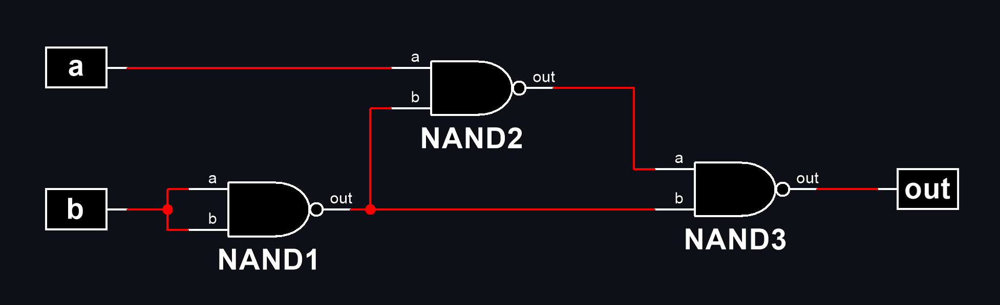
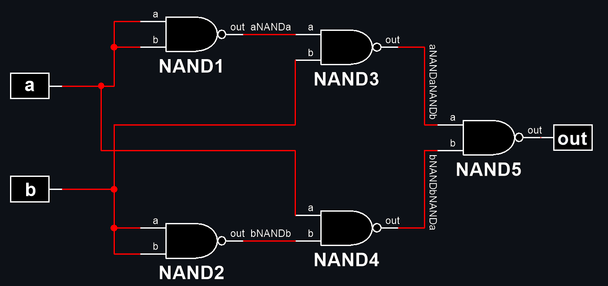
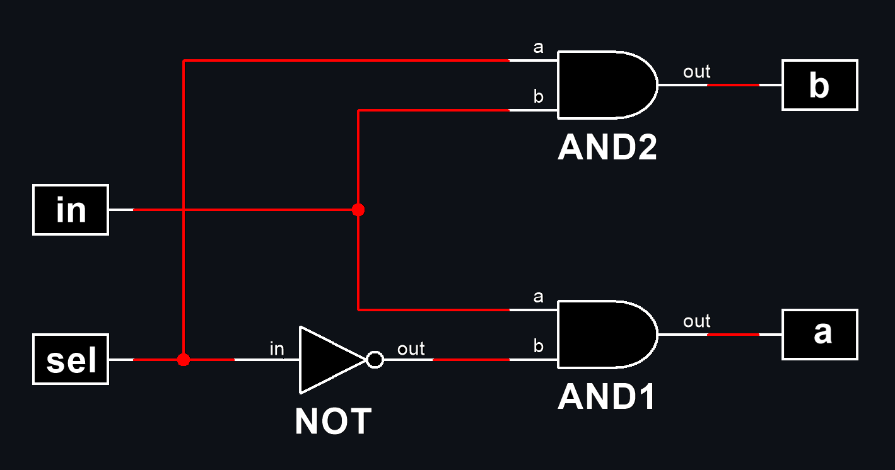
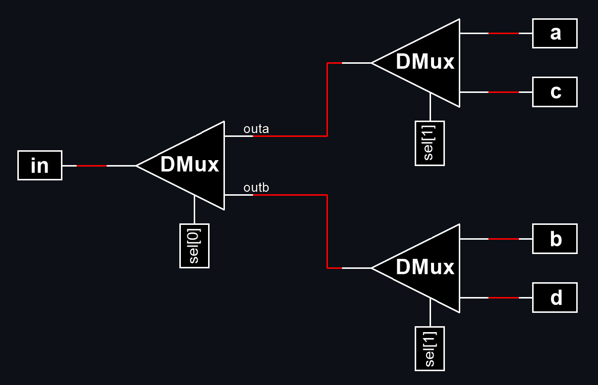
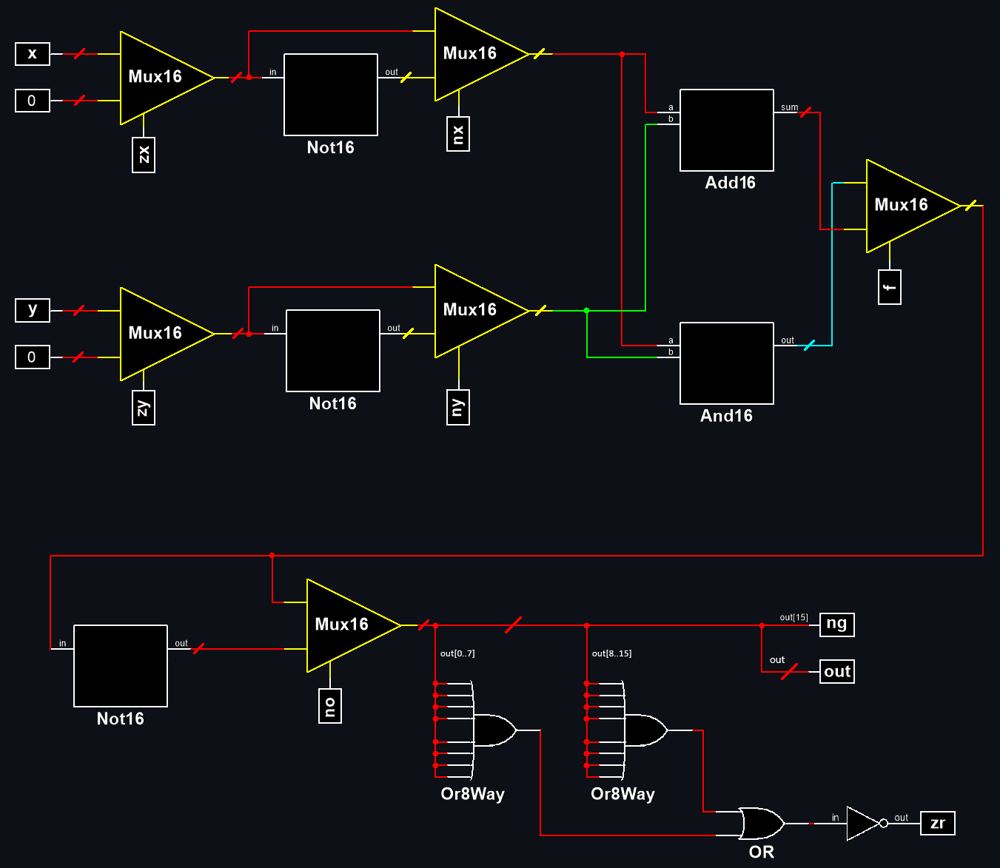
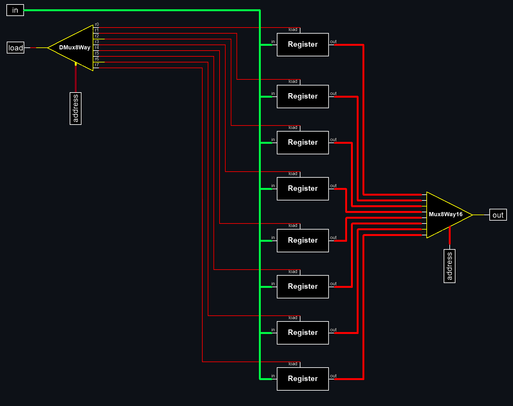

# from-nand-to-tetris

In this repository I implement all the tasks from the course Build a Modern Computer from First Principles: From Nand to Tetris (Project-Centered Course) Part I (Part II is coming).
I took the course on [coursera](https://coursera.org/share/c4583b709272444e504a4562e1cfa0b8).

Course Resources:: 
* [From Nand to Tetris website](https://www.nand2tetris.org/)
* [IDE](https://nand2tetris.github.io/web-ide/chip/)
* Book: The Elements of Computing Systems: Building a Modern Computer from First Principles by Noam Nisan, Shimon Schocken
Russian edition: Ноам Нисан, Шимон Шокен. Архитектура компьютерных систем. Как собрать современный компьютер по всем правилам
 
# projects tasks
<details>

<summary>project1: Boolean Logic</summary>

## Nand (given)
Chip name: `Nand`

Input: `a, b`

Output: `out`

Function: `if ((a==1) and (b==1)) then out = 0, else out = 1`

|a|b|out|
|-|-|-|
|0|0|1|
|0|1|1|
|1|0|1|
|1|1|0|
 
## Not
Chip name: `Not`

Input: `in`

Output: `out`

Function: `if (in==0) then out = 1, else out = 0`

|in|out|
|-|-|
|0|1|
|1|0|

### My implementation:


## And
Chip name: `And`

Input: `a, b`

Output: `out`

Function: `if ((a==1) and (b==1)) then out = 1, else out = 0`

|a|b|out|
|-|-|-|
|0|0|0|
|0|1|0|
|1|0|0|
|1|1|1|

### My implementation:


## Or
Chip name: `Or`

 Input: `a, b`
 
 Output: `out`
 
 Function: `if ((a==0) and (b==0)) then out = 0, else out = 1`

|a|b|out|
|-|-|-|
|0|0|0|
|0|1|1|
|1|0|1|
|1|1|1|

### My implementation:



## Xor
 Chip name: `Xor`
 
 Input: `a, b`
 
 Output: `out`
 
 Function: `if (a!=b) then out = 1, else out = 0`

|a|b|out|
|-|-|-|
|0|0|0|
|0|1|1|
|1|0|1|
|1|1|0|

### My implementation:



## Mux
Chip name: `Mux`

 Input:     `a, b, sel`
 
 Output:    `out`
 
 Function:  `if (sel == 0) then out = a, else out = b`

| a | b |sel|out|
|-|-|-|-|
| 0 | 0 | 0 | 0 |
| 0 | 0 | 1 | 0 |
| 0 | 1 | 0 | 0 |
| 0 | 1 | 1 | 1 |
| 1 | 0 | 0 | 1 |
| 1 | 0 | 1 | 0 |
| 1 | 1 | 0 | 1 |
| 1 | 1 | 1 | 1 |

sel|out|
|-|-|
|0|a|
|1|b|

### My implementation:


## DMux
 Chip name: `DMux`
 
 Input:     `in, sel`
 
 Output:    `a, b`

 Function: `if (sel==0) then {a,b}={in,0}, else {a,b}={0,in}`

|  in   |  sel  |   a   |   b   |
|-|-|-|-|
|   0   |   0   |   0   |   0   |
|   0   |   1   |   0   |   0   |
|   1   |   0   |   1   |   0   |
|   1   |   1   |   0   |   1   |
 
### My implementation:



## Not16
 Chip name: `Not16`
 
 Input: `in[16]`
 
 Output: `out[16]`
 
 Function: `for i = 0..15 out[i] = Not(in[i])`

### My implementation:


## And16
Chip name: `And16`

 Input: `a[16], b[16]`
 
 Output: `out[16]`
 
 Function: `for i = 0..15 out[i] = And(a[i], b[i])`

### My implementation:


## Or16
Chip name: `Or16`

 Input: `a[16], b[16]`
 
 Output: `out[16]`
 
 Function: `for i = 0..15 out[i] = Or(a[i], b[i])`

### My implementation:


## Mux16
Chip name: `Mux16`

 Input: `a[16], b[16], sel`
 
 Output: `out[16]`
 
 Function: `if (sel==0) then for i = 0..15 out[i] = a[i],
 else for i = 0..15 out[i] = b[i]`
 
### My implementation:


## Or8Way
Chip name: `Or8Way`

 Input: `in[8]`
 
 Output: `out`
 
 Function: `out = Or(in[0], in[1],…, in[7])`

### My implementation:


## Mux4Way16
 Chip name: `Mux4Way16`
 
 Input: `a[16], b[16], c[16], d[16], sel[2]`
 
 Output: `out[16]`
 
 Function: `if (sel==00,01,10, or 11) then out = a, b, c, or d`
 
 Comment: `The assignment is a 16-bit operation.
 For example, "out = a" means "for i = 0..15 
out[i] = a[i]"`

|sel[1]|sel[0]|out|
|-|-|-|
|0|0|a|
|0|1|b|
|1|0|c|
|1|1|d|

### My implementation:


## Mux8Way16
 Chip name: `Mux8Way16`

 Input: `a[16], b[16], c[16], d[16], e[16], f[16], 
g[16], h[16], sel[3]`

 Output: `out[16]`

 Function: `if (sel==000,001,010, …, or 111)then out = a, 
b, c, d, …, or h`

 Comment: `The assignment is a 16-bit operation.
 For example, "out = a" means "for i = 0..15 
out[i] = a[i]".`

|sel[2]|sel[1]|sel[0]|out|
|-|-|-|-|
|0|0|0|a|
|0|0|1|b|
|0|1|0|c|
|0|1|1|d|
|1|0|0|e|
|1|0|1|f|
|1|1|0|g|
|1|1|1|h|

### My implementation:


## DMux4Way
Chip name: `DMux4Way`

 Input: `in, sel[2]`

 Output: `a, b, c, d`

 Function: 
 ```
if (sel==00) then {a, b, c, d} = {1,0,0,0},
 else if (sel==01) then {a, b, c, d} = {0,1,0,0},
 else if (sel==10) then {a, b, c, d} = {0,0,1,0},
 else if (sel==11) then {a, b, c, d} = {0,0,0,1}
```

|sel[1]|sel[0]|a|b|c|d|
|-|-|-|-|-|-|
|0|0|in|0|0|0|
|0|1|0|in|0|0|
|1|0|0|0|in|0|
|1|1|0|0|0|im|

### My implementation:



## DMux8Way
Chip name: `Dmux8Way`

 Input: `in, sel[3]`

 Output: `a, b, c, d, e, f, g, h`

 Function:  
```
if (sel==000) then {a, b, c,…, h} = {1,0,0,0,0,0,0,0},
else if (sel==001) then {a, b, c,…, h} = {0,1,0,0,0,0,0,0},
else if (sel==010) then {a, b, c,…, h} = {0,0,1,0,0,0,0,0},
 …
else if (sel==111) then {a, b, c,…, h} = {0,0,0,0,0,0,0,1}
```
|sel[2]|sel[1]|sel[0]|a|b|c|d|e|f|g|h|
|-|-|-|-|-|-|-|-|-|-|-|
|0|0|0|in|0|0|0|0|0|0|0|
|0|0|1|0|in|0|0|0|0|0|0|
|0|1|0|0|0|in|0|0|0|0|0|
|0|1|1|0|0|0|in|0|0|0|0|
|1|0|0|0|0|0|0|in|0|0|0|
|1|0|1|0|0|0|0|0|in|0|0|
|1|1|0|0|0|0|0|0|0|in|0|
|1|1|1|0|0|0|0|0|0|0|in|

### My implementation:


</details>

<details>

<summary>project2: Boolean Arithmetic</summary>

## HalfAdder
Chip name: `HalfAdder`

 Input:     `a, b`
 
 Output:    `sum, carry`

 Function: `sum = LSB of a + b; carry = MSB of a + b`

|a|b|carry|sum|
|-|-|-|-|
|0|0|0|0|
|0|1|0|1|
|1|0|0|1|
|1|1|1|0|

### My implementation:


## FullAdder

Chip name: `FullAdder`

Input: `a, b, c`

Output: `sum, carry`

Function: `sum = LSB of a + b + c; carry = MSB of a + b + c`

|a|b|c|carry|sum|
|-|-|-|-|-|
|0|0|0|0|0|
|0|0|1|0|1|
|0|1|0|0|1|
|0|1|1|1|0|
|1|0|0|0|1|
|1|0|1|1|0|
|1|1|0|1|0|
|1|1|1|1|1|

### My implementation:


## Add16

Chip name: `Add16`

 Input:     `a[16], b[16]`

 Output:    `out[16]`

 Function:  `Adds two 16-bit numbers.
           The overflow bit is ignored.`

### My implementation:


## Inc16
 Chip name: `Inc16`

 Input: `in[16]`

 Output: `out[16]`

 Function: `out = in + 1. The overflow bit is ignored.`

### My implementation:


## ALU

Chip name: `ALU`

Input: `x[16], y[16], zx, nx, zy, ny, f, no`

Output: `out[16], zr, ng`

Function:
```
if zx x=0
if nx x!=0
if zy y=0
if ny y=!y
if f out=x+y, else out=x&y
if out==0 zr=1, else zr=0
if out<0 ng=1, else ng=0
The overflow bit is ignored.
```

### My implementation:



|if zx then x=0|if nx then x=!x|if zy then y=0|if ny then y!=y|if f then out=x+y else out=x&y|if no then out!=out|out(x,y)|
|-|-|-|-|-|-|-|
| 1 | 0 | 1 | 0 | 1 | 0 | 0 |
| 1 | 1 | 1 | 1 | 1 | 1 | 1 |
| 1 | 1 | 1 | 0 | 1 | 0 | -1 |
| 0 | 0 | 1 | 1 | 0 | 0 | x |
| 1 | 1 | 0 | 0 | 0 | 0 | y |
| 0 | 0 | 1 | 1 | 0 | 1 | !x |
| 1 | 1 | 0 | 0 | 0 | 1 | !y |
| 0 | 0 | 1 | 1 | 1 | 1 | -x |
| 1 | 1 | 0 | 0 | 1 | 1 | -y |
| 0 | 1 | 1 | 1 | 1 | 1 | x+1 |
| 1 | 1 | 0 | 1 | 1 | 1 | y+1 |
| 0 | 0 | 1 | 1 | 1 | 0 | x-1 |
| 1 | 1 | 0 | 0 | 1 | 0 | y-1 |
| 0 | 0 | 0 | 0 | 1 | 0 | x+y |
| 0 | 1 | 0 | 0 | 1 | 1 | x-y |
| 0 | 0 | 0 | 1 | 1 | 1 | y-x |
| 0 | 0 | 0 | 0 | 0 | 0 | x&y |
| 0 | 1 | 0 | 1 | 0 | 1 | x|y |

> if (out==0) zr=1, else zr=0

> if (out<0) ng=1, else ng=0
</details>

<details>

<summary>project3: Memory</summary>

## DFF (given)

 Chip name: `DFF`

 Input: `in`

 Output: `out`

 Function: `out(t)=in(t-1)`

 Comment: 
```
This clocked gate has a built-in
implementation and thus there is
no need to implement it.
```

## Bit

 Chip name: `Bit`

 Input: `in, load`

 Output: `out`

 Function: `If load(t-1) then out(t)=in(t-1) else out(t)=out(t-1)`

### My implementation:


## Register

Chip name: `Register`

Input: `in[16], load`

Output: `out[16]`

Function: `If load(t-1) then out(t)\in(t-1) else out(t)\out(t-1)`

Comment: `"\" is a 16-bit operation.`

### My implementation:


## RAMn

Chip name: `RAMn // n and k are listed below`

Input: `in[16], address[k], load`

Output: `out[16]`

Function: 
```
out(t)=RAM[address(t)](t)
If load(t-1) then
 RAM[address(t-1)](t)\in(t-1)
```

Comment: `"\" is a 16-bit operation.`

### My implementation:

### RAM8
Chip name: `RAM8`

Input: `in[16], address[3], load`

Output: `out[16]`


### RAM64
Chip name: `RAM64`

Input: `in[16], address[6], load`

Output: `out[16]`


### RAM512
Chip name: `RAM512`

Input: `in[16], address[9], load`

Output: `out[16]`


### RAM4K
Chip name: `RAM4K`

Input: `in[16], address[12], load`

Output: `out[16]`


### RAM16K
Chip name: `RAM16K`

Input: `in[16], address[14], load`

Output: `out[16]`


## PC

Chip name: `PC  // 16-bit counter`

Input: `in[16], inc, load, reset`

Output: `out[16]`

Function: 
```
If reset(t-1) then out(t)\0
 else if load(t-1) then out(t)\in(t-1)
  else if inc(t-1) then out(t)\out(t-1)+1
   else out(t)\out(t-1)
```

Comment: `"\" - is a 16-bit operation. "+" is 16-bit arithmetic addition.`

### My implementation:


</details>

<details>

<summary>project4: Machine Language</summary>

## Multiplication Program (Mult.asm): 
The inputs of this program are the current values stored in `R0` and
`R1` (i.e., the two top RAM locations). The program computes the product `R0*R1` and stores the result in
`R2`. We assume (in this program) that `R0>=0`, `R1>=0`, and `R0*R1<32768`. Your program need not test
these conditions, but rather assume that they hold. The supplied Mult.tst and Mult.cmp scripts will test
your programon several representative data values.

Pseudocode:
```
R2 = 0;
for (i=R1,i>=0,i--) {
 R2 += R0;
}
```

## I/O-Handling Program (Fill.asm): 
This program runs an infinite loop that listens to the keyboard input.
When a key is pressed (any key), the program blackens the screen, namely, writes “black” in every pixel.
When no key is pressed, the screen should be cleared. You may choose to blacken and clear the screen in
any spatial order, as long as pressing a key continuously for long enough will result in a fully blackened
screen and not pressing any key for long enough will result in a cleared screen. This program has a test
script (Fill.tst) but no compare file—it should be checked by visibly inspecting the simulated screen.

Pseudocode:
```
prev=0;

while(0) {
 if(kbd==0) call white();
 else call black();
}

white() {    // checks that the screen is white
 now=0;
 check = now - prev; // if 0 - do nothing
 prev = 0;           // remember last state
 if(check==0) return;
 else call clear();
}

black() {    // checks that the screen is black
 now=-1;
 check = now - prev;
 prev = -1;
 if(check==0) return;
 else call fill();
}

clear() {
 for(i=8191,i>=0,i--) {
  RAM[SCREEN+i]=0;   // SCREEN =  initial screen register
 }
}

fill() {
  for(i=8191,i>=0,i--) {
  RAM[SCREEN+i]=-1;   // SCREEN = the start register of the screen
 }
}
```

</details>

<details>

<summary>project5: Computer Architecture</summary>

## Memory 

Chip name: `Memory`

Input:
```
in[16],         // Complete memory address space
load,           // What to write
address[15]     // Where to write
```

Output:
```
out[16]         // Memory value at the given address
```

Function:
```
1. out(1)=Memory[address(t)](t)
2. If load(t-1) then emory[address(t-1)](t)=in(t-1)
(t is the current time unit, or cycle)
```

Comment:
```
Access to any address>24576 (0x6000) is invalid.
Access to any address in the range 16384-24575
(0x4000-0x5FFF) results in accessing the screen 
memory map. Access to address 24576 (0x6000) results
in accessing the keyboard memory map. The behavior
in these address is described in the Screen and
Keyboard chip specifications.
```

### My implementation:


## CPU 

Chip name: `CPU`

Input:
```
inM[16],                   // M value input (M = contents of RAM[A])
instruction[16],           // Instruction for execution
reset                      // Signals whether to restart the current 
                           // program (reset-1) or continue executing
                           // the current program (reset=0) 
```

Output:
```
outM[16],         // M value output
writeM,           // Write to M?
addressM[15],     // Address of M in data memory
pc[15],           // Address of next instruction
```

Function:
```
Executes the instruction according to the Hack machine language
specification. The D and A in the language specification refer to
CPU-resident registers, while M refers to the memory location
addressed by A (inM holds the value of this location).

If the instruction needs to write a value to M, the value is
placed in outM, the address is placed in addressM, and the wtiteM
bit is asserted. (When writeM=0, any value may appear in outM.)

If reset=1, then the CPU jumps to address 0 (i.c., sets pc=0 in
the next time unit) rather than to the address resulting from
executing the current instruction.
```

### My implementation:


## Computer 

Chip name: `Computer`

Input:
```
reset
```

Function:
```
When reset is 0, the program stored in the computer's
ROM executes. When reset is 1, the execution of the
program restarts. Thus, to start a program's
execution, reset must be pushed "up" (1) and then
"down" (0).

From this point onward the user is at the mercy of
the software. In particular, depending on the
program's code, the screen may show some output and
the user may be able to interact with the computer
via the keyboard.
```

### My implementation:


</details>


<details>

<summary>project6: Assembler</summary>

## Objective

 Develop an assembler that translates programs written in the Hack assembly language into Hack
binary code. This version of the assembler assumes that the source assembly code is valid. Error
checking, reporting and handling can be added to later versions of the assembler, but are not part
of this project. 
>There is no this function in my code yet, it is assumed that my interpretation is always correct :)

## Implementation
In the textbook, the course teachers suggest initializing an object of the Parser class by opening a file. I preferred to open the file once and write all the information into the program at once, using try-with-resources block to avoid breaking the file. But in order to preserve the API proposed by the authors, I simulated iteration through the file by ordinary passage through the list, creating a index inside the class, which is controlled by the methods `hasMoreLines()`, `advance()` and `jumpFirst()` (to return the label to the beginning).

## Classes

#### `AssemblerHack.java` class translates Hack assembly language mnemonics into Hack binary code.
>The main class that manages the entire process of building a binary program, using the instance of the `Parser` class to access the .asm file, the instance of the `HackSymbolTable` class to access labels and variables addresses, and the `Code` utility class to obtain binary representations of decimal values ​​and mnemonics. The result (binary program) is collected in `ArrayList code`, then written to the created .hack file, under the control of `AssemblerHack` instance methods.


#### `HackSymbolTable.java` manages a symbol table that associates symbolic labels with numeric addresses. This is used in the context of the Hack computer system.

API:

`HackSymbolTable()` - constructs a new HackSymbolTable and initializes it with predefined symbols.

`addEntry(String symbol, int address)` - adds the pair (symbol, address) to the table.

`contains(String symbol)` - does the symbol table contain the given symbol?

`getAddress(String symbol)` - returns the address associated with the given symbol.


#### `Parser.java` - The Parser class is used to read and parse assembly language files.

>The Parser module provides access to the input assembly code. In particular, it provides a convenient means of moving through source code, skipping comments and whitespace, and breaking down each symbolic command into its basic components.

API:

`Parser(String location)` - creates a Parser object and initializes it with a List program, which will be filled in as the file is read, located at location.

`getInstruction()` - returns the current instruction.

`hasMoreLines()` - are there more commands in the input?

`jumpFirst()` - resets the instruction pointer to the first instruction.

`advance()` - read the next command from the input and makes it hte current command.

`instructionType()` - returns the type of the current instruction:
> A_INSTRUCTION for @xxx where xxx is either a symbol or a decimal number

>C_INSTRUCTION for dest=comp;jump

>L_INSTRUCTION (actually, pseudo-command) for (xxx) where xxx is a symbol

`dest()` - returns the destination mnemonic in the current C-instruction.

`comp()` - returns the computation mnemonic in the current C-instruction.

`jump()` - returns the jump mnemonic in the current C-instruction.


#### `InstructionType.java`
>The InstructionType enum represents the different types of instructions in the Hack assembly language.


#### `Code.java`
>The utility class contains static methods to convert assembly language mnemonics into their corresponding binary codes for the Hack computer. This class uses value maps for comp and jump mnemonics - compMap and jumpMap.

API:

`dest(String dest)` - returns the binary code of the dest mnemonic.

`comp(String comp)` - returns the binary code of the comp mnemonic.

`jump(String jump)` - returns the binary code of the jump mnemonic.

`bits(int n)` - converts an integer to its 15-bit binary representation.

</details>
